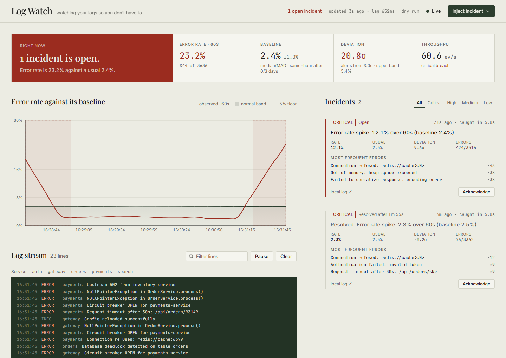
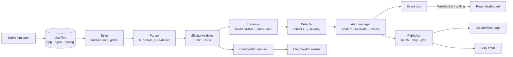

<div align="center">

# Log Watch

**Real-time log anomaly detection that tells you *when* something breaks, *how badly*, and *why*.**

It tails live log files, learns what "normal" looks like, and pushes an alert to your dashboard, CloudWatch and SNS within seconds of an error spike.




</div>

---

## At a glance

| | |
|---|---|
| ⚡ **Alert on screen** | **1.6 – 2.6 s** after a spike starts (live end-to-end test, budget 4 s) |
| 📥 **Ingest lag** | **~110 ms** p95 from a line being written to it being analysed |
| 🎯 **Incidents caught** | **36 / 36** across 15 simulated days at 30 req/s, with **0.2 false alarms/day** |
| 🔁 **Resilient** | Survives log rotation, backend restarts (no page reload) and AWS outages |
| 🧪 **Tested** | 143 unit/integration tests, a live smoke test and a detector benchmark |

---

## The problem → our answer

| Requirement | How Log Watch does it |
|---|---|
| Monitor a continuously growing log file | Async tailer with byte-exact offsets. Handles rotation and truncation, follows **multiple files and globs**, and auto-detects **JSON, Python logging, nginx/apache and syslog** |
| Rolling error rate over a sliding window | 1-second buckets feeding **two windows at once**: 5 min for accuracy, 60 s for speed |
| Establish a baseline | **Median/MAD** over recent calm traffic (robust to spikes), plus an optional **same-time-of-day** profile |
| Detect deviations | Robust z-score with an absolute-rate floor, a low-traffic gate and a sampling-noise floor |
| Severity levels | LOW → MEDIUM → HIGH → CRITICAL, with confirmation, escalation, auto-resolve and cooldown (no flapping) |
| Real-time frontend | WebSocket push with automatic **polling fallback** and reconnect-without-reload |
| Show alerts as they happen | Live incident feed with root-cause error messages, a toast, and a shaded breach on the chart |
| Push to CloudWatch / SNS | Batched CloudWatch Logs, SNS by severity, **custom CloudWatch metrics + alarms**, retries with backoff |

---

## What makes it different

### 1. A baseline that doesn't get fooled
Error rates are mostly flat with sudden spikes, which is not a bell curve. A mean/std baseline gets dragged along by the incident it should be catching. We use **median ± MAD** instead, and backed that choice with data:

| Baseline | Incidents caught (of 36) |
|---|---|
| Mean / std (EWMA) | as few as **9** — it "learns" slow ramps while they build up |
| **Median / MAD** | **36** in 4 of 5 window setups (32–33 in the slowest one) |

### 2. Fast *and* quiet: two windows
A 60 s window is fast but alarms on harmless 20-second blips. A 5-minute window is quiet but slow. Log Watch runs both: the 5-minute window can raise any alert, and the 60-second window only raises **severe** ones.

| Strategy (30 req/s) | Spike caught after | False alarms/day |
|---|---|---|
| 60 s window | 12 s | 3.7 |
| 5 min window | 35.5 s | 0 |
| **Log Watch (both)** | **20.5 s** | **0.2** |

### 3. It knows your daily rhythm
Nightly batch jobs and morning peaks are *normal*. Once 3 days of history exist, Log Watch compares "now" with **the same time on previous days** (±15 min). It takes the majority across days, so one bad day can't teach it that an outage is normal. In the benchmark this took false alarms in recurring busy hours to **zero**.

> Every number above comes from `make benchmark`. It replays 3 × 5 simulated days (daily patterns, noise, self-healing blips and 36 injected incidents) through the **same detection code the live service runs**. Full results: [`docs/detector-benchmark.md`](docs/detector-benchmark.md).

---

## Architecture



**Stack:** Python 3.12+ · FastAPI · asyncio · boto3 · React 18 · TypeScript · Vite · Tailwind · Recharts · Docker · CloudFormation

---

## Quick start

**With Docker** (dashboard, backend and traffic simulator):
```bash
docker compose up --build -d        # → http://localhost:5173
```

**Locally**, in three terminals:
```bash
cd backend && pip install -r requirements.txt
LOG_FILE_PATH=../data/app.log python -m uvicorn app.main:app --port 8000
```
```bash
cd backend && python -m simulator.generate_logs --file ../data/app.log --rps 30
```
```bash
cd frontend && npm install && npm run dev   # → http://localhost:5173
```

Give the baseline about 2 minutes to learn, then click **Inject incident** in the header. No AWS account is needed: alerts go to a local log in `dry_run` mode.

### Watch your real logs
```bash
LOG_SOURCES="/var/log/nginx/access.log,/srv/app/logs/*.log" ENABLE_SIM=false \
  python -m uvicorn app.main:app --port 8000
```
Files that match a glob later are picked up automatically, and restarts never replay old lines.

### Turn on AWS
```bash
aws configure
ALERT_EMAIL=you@example.com bash infra/aws-setup.sh    # deploys infra/cloudformation.yaml
```
Then set `PUBLISH_MODE=aws` and the printed `SNS_TOPIC_ARN`. The stack creates:
- the CloudWatch log group and stream;
- the SNS topic with an email subscription;
- an **error-rate alarm** and a **"detector went silent" alarm**;
- a **least-privilege IAM policy**.

If AWS goes down, detection keeps running and each alert card shows its delivery status.

---

## Configuration

Everything is set by environment variable (see [`.env.example`](.env.example)). Invalid values stop startup with a clear message. The main settings:

| Variable | Default | What it does |
|---|---|---|
| `LOG_SOURCES` | – | Extra files or globs to tail |
| `WINDOW_SECONDS` / `FAST_WINDOW_SECONDS` | `300` / `60` | Main and fast windows (`0` turns off the fast one) |
| `BASELINE_METHOD` | `mad` | `mad` (robust) or `ewma` |
| `SEASONAL_ENABLED` | `true` | Same-time-of-day baseline once 3 days of history exist |
| `Z_LOW … Z_CRITICAL` | `3 / 4.5 / 6.5 / 9` | Severity thresholds |
| `PUBLISH_MODE` | `dry_run` | `dry_run` or `aws` |
| `ENABLE_SIM` | `true` | Simulator endpoints (turn off in production) |

---

## Testing

```bash
cd backend && python -m pytest -q      # 143 tests, AWS mocked with moto (~20 s)
python scripts/smoke_realtime.py       # live end-to-end run with a real server, WebSocket and alert (~1 min)
cd backend && python -m benchmark.run  # detector benchmark → docs/detector-benchmark.md (~3 min)
```

The smoke test starts a real server and simulator, injects a spike, and checks four things:
- the alert arrives over WebSocket within budget, with the correct severity;
- polling returns the same alert;
- the alert was published;
- the alert resolves on its own.

---

## Project layout

```
backend/
  app/          tailer · parser · window · baseline · detector · alerts · evaluator · api · publishers
  simulator/    realistic traffic + spike / ramp / flood / outage scenarios
  benchmark/    detector comparison on synthetic days with injected incidents
  tests/        143 tests
frontend/src/   dashboard: live feed hook, chart, incidents, log stream
infra/          CloudFormation, IAM policy, setup script
scripts/        live end-to-end smoke test
```

---

## What's next
- Per-service error rates and traffic-volume anomalies
- Durable alert history (CloudWatch Logs already holds it)
- One-click deploy to ECS

<div align="center"><sub>Built for the hackathon · Python · React · AWS</sub></div>
