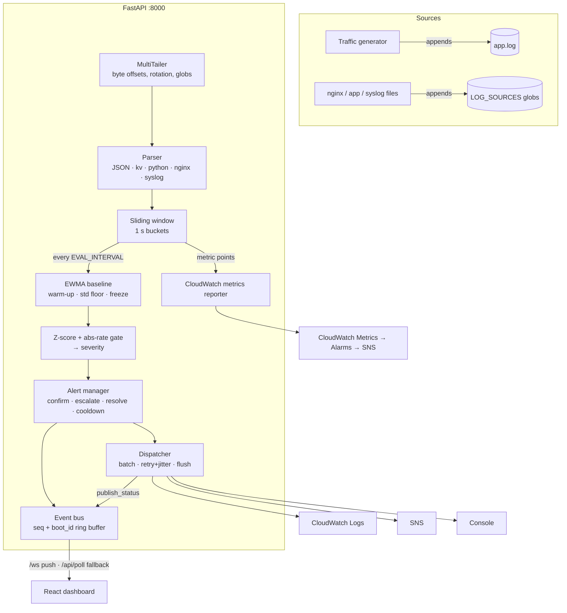

# Accentra — Real-Time Log Anomaly Detector

> **Python (FastAPI) + React (TypeScript + Vite)** observability service. It tails live log files (your real ones or a built-in traffic generator), computes a rolling error rate over a sliding window, learns a baseline with EWMA, detects deviations with z-scores and assigns a severity. Alerts stream to the browser over WebSocket (with polling fallback) and are published to **AWS CloudWatch Logs, SNS and CloudWatch Metrics/Alarms**.

Measured on a laptop with the live smoke test (`make smoke`): **alert on the dashboard 1.6 s after an error spike starts** (budget 4 s with 1 s evaluation), **ingest lag p95 ≈ 110 ms** from a line being written to it being analysed.

---

## ⚡ Quick start (local, three terminals)

Backend and generator must point at the **same** log file (the simulator control file lives next to it).

```bash
# 1. Backend  (bash; PowerShell: $env:LOG_FILE_PATH="../data/app.log"; python -m uvicorn app.main:app --port 8000)
cd backend && pip install -r requirements.txt
LOG_FILE_PATH=../data/app.log python -m uvicorn app.main:app --port 8000

# 2. Traffic generator
cd backend && python -m simulator.generate_logs --file ../data/app.log --rps 30 --base-error 0.02

# 3. Dashboard
cd frontend && npm install && npm run dev        # http://localhost:5173
```

With `make`: `make dev-backend`, `make dev-sim`, `make dev-frontend`, `make test`, `make smoke`.

## 🐳 Docker

```bash
docker compose up --build -d          # backend + generator + dashboard → http://localhost:5173
docker compose ps                     # backend/frontend report (healthy) via /api/ready
```

Containers run as non-root, the backend healthcheck gates on readiness, and the app logs are JSON lines (`LOG_JSON=true`).

---

## 📡 Monitoring real logs

Point `LOG_SOURCES` at files and/or globs (comma-separated). New files that match a glob are picked up automatically, and rotation (rename or copytruncate) and truncation are handled. Files that exist at startup are tailed from the end, so a restart never replays history. Files created later are read from their first byte.

```bash
# Local
LOG_SOURCES="/var/log/nginx/access.log,/srv/app/logs/*.log" ENABLE_SIM=false \
  python -m uvicorn app.main:app --port 8000

# Docker: host directory is mounted read-only at /var/log/host
HOST_LOG_DIR=/var/log/nginx LOG_SOURCES='/var/log/host/*.log' ENABLE_SIM=false \
  docker compose up --build -d backend frontend
```

Formats are auto-detected per line (`LOG_FORMAT=auto`), so one instance can follow mixed files:

| Format | Example | Level |
|---|---|---|
| JSON / ECS | `{"ts":"…","level":"error","service":"cart","msg":"…"}` | `level` / `severity` / `log.level` |
| key=value | `2026-09-28T10:15:03Z ERROR service=api msg="…"` | level token |
| Python `logging` | `2026-09-28 10:15:03,412 ERROR app.db: …` or `… - app.db - ERROR - …` | levelname |
| nginx / apache | `10.0.0.1 - - [28/Sep/2026:10:15:03 +0000] "GET /pay HTTP/1.1" 502 …` | 5xx → ERROR, 4xx → WARNING |
| syslog 5424 / 3164 | `<11>1 2026-… host sshd …` / `Sep 28 10:15:03 host app[1]: …` | PRI, else keywords |

`/api/health` shows the files being tailed, lines read/dropped, parse failures and latency.

---

## ☁️ AWS (CloudWatch Logs, SNS, Metrics, Alarms)

`PUBLISH_MODE=dry_run` (default) prints alerts locally, so no AWS account is needed. For real publishing:

```bash
aws configure                                               # your credentials, never stored in this repo
ALERT_EMAIL=you@example.com AWS_REGION=ap-south-1 bash infra/aws-setup.sh
```

`infra/aws-setup.sh` deploys `infra/cloudformation.yaml` and prints the values to put in `.env`. The stack creates:

- log group `/hackathon/log-anomaly-detector` with stream `alerts` (one JSON event per OPENED, ESCALATED or RESOLVED alert);
- SNS topic `log-anomaly-alerts` with an email subscription (confirm the email). Notifications are filtered by `SNS_MIN_SEVERITY`, and RESOLVED messages are filtered by the alert's peak severity;
- alarm **`accentra-error-rate-high`** on the custom metric `LogAnomaly/ErrorRate`. It fires even if the app's own alerting is down;
- alarm **`accentra-detector-silent`**, a dead-man's switch that fires after 5 minutes without metrics;
- a least-privilege managed policy (also in `infra/iam-policy.json`) to attach to the EC2, ECS or user identity that runs the detector.

Then set `PUBLISH_MODE=aws`, `SNS_TOPIC_ARN=…` and restart. Verify with:

```bash
aws logs filter-log-events --log-group-name /hackathon/log-anomaly-detector --limit 5
aws cloudwatch list-metrics --namespace LogAnomaly
```

Publishing is asynchronous and never blocks detection:
- CloudWatch Logs writes are batched, respecting the 10k-event and 1 MB limits.
- Metrics are buffered and sent once per `CW_METRICS_INTERVAL_SEC`.
- Failures retry with exponential backoff and jitter.
- Every alert card shows each publisher's result (`CW ✓`, `SNS –`, `LOCAL ✓`, or ✗ if it failed).
- Queued alerts are flushed on shutdown.

**Deploy path (documented, not automated):** run `docker compose up -d backend frontend` on an EC2 instance whose instance profile has the `DetectorPolicyArn` output attached, and mount the host's log directory via `HOST_LOG_DIR`. On ECS, use the same two images with the policy on the task role and ship logs to a shared volume. Put the dashboard behind an ALB with WebSocket idle timeout ≥ 60 s.

---

## 🏗️ Architecture



Realtime transport:
- Clients get a snapshot on connect, then pushed `metric`, `alert`, `alert_update`, `baseline` and `log` envelopes, plus a heartbeat every 15 s.
- If the WebSocket keeps failing, the dashboard switches to polling `/api/poll?since_seq=` and keeps retrying the socket with exponential backoff.
- A `boot_id` lets clients notice a backend restart and rewind their cursor, so the page recovers without a reload.
- The header shows the connection mode, the age of the last event (red when stale) and ingest lag p95.

---

## ⚙️ Configuration (`.env`, see `.env.example`)

Invalid values stop the process at startup with a readable message, for example `Z thresholds must increase`.

| Variable | Default | Description |
|---|---|---|
| `LOG_FILE_PATH` | `./data/app.log` | Primary log file (the simulator writes here) |
| `LOG_SOURCES` | *(empty)* | Extra files/globs, comma-separated |
| `LOG_FORMAT` | `auto` | `auto`, `text`, `json`, `python`, `nginx`, `syslog` |
| `WINDOW_SECONDS` / `EVAL_INTERVAL_SEC` | `60` / `5` | Sliding window length / evaluation cadence |
| `MIN_EVENTS_IN_WINDOW` | `20` | Skip evaluation on sparse traffic (no 1-of-2 = 50 % false alarms) |
| `BASELINE_WARMUP_SAMPLES` / `BASELINE_ALPHA` / `BASELINE_MIN_STD` | `24` / `0.05` / `0.01` | Warm-up, EWMA smoothing, std floor |
| `BASELINE_PATH` | `./data/baseline.json` | Persisted baseline (restarts skip warm-up) |
| `Z_LOW` / `Z_MEDIUM` / `Z_HIGH` / `Z_CRITICAL` | `3 / 4.5 / 6.5 / 9` | Severity boundaries |
| `MIN_ABS_RATE` / `ABS_RATE_CRITICAL` | `0.05` / `0.50` | Absolute floor / always-critical rate |
| `CONFIRM_TICKS` / `RESOLVE_TICKS` / `ALERT_COOLDOWN_SEC` | `2` / `3` / `120` | Hysteresis |
| `PUBLISH_MODE` | `dry_run` | `dry_run` or `aws` |
| `SNS_TOPIC_ARN` / `SNS_MIN_SEVERITY` | – / `MEDIUM` | SNS target and filter |
| `CW_METRICS_ENABLED` / `CW_METRICS_INTERVAL_SEC` | `true` / `60` | Custom metrics (aws mode) |
| `PUBLISH_MAX_RETRIES` / `PUBLISH_BACKOFF_BASE_SEC` | `3` / `1.0` | Dispatcher retry policy |
| `LOG_JSON` / `APP_LOG_LEVEL` | `false` / `INFO` | The detector's own logs |
| `ENABLE_SIM` | `true` | Enables `/api/sim/*` (turn off in production) |

## 🔌 API

| Endpoint | Purpose |
|---|---|
| `GET /api/health` | Liveness: sources, lines read/dropped, parse failures, baseline, latency, publisher stats |
| `GET /api/ready` | Readiness (503 until the pipeline runs and a source is tailed) |
| `WS /ws` | Snapshot + live envelopes |
| `GET /api/poll?since_seq=N` | Polling fallback (`envelopes`, `latest_seq`, `boot_id`) |
| `GET /api/metrics`, `/api/alerts`, `/api/alerts/active`, `/api/logs/recent`, `/api/config` | Hydration |
| `POST /api/alerts/{id}/ack` | Acknowledge (broadcast to all clients) |
| `POST /api/sim/spike` `{scenario, error_ratio, duration_sec}` / `POST /api/sim/recover` | Demo scenarios: `spike`, `ramp`, `flood` (×10 volume), `outage` (errors then silence), `flapping` |

---

## 🧪 Testing

```bash
cd backend && python -m pytest -q      # 117 unit/integration tests (~20 s), AWS via moto
python scripts/smoke_realtime.py       # live E2E: real server + generator + WebSocket (~1 min)
```

What the tests cover:
- **Parser:** every format, plus timezone handling.
- **Tailer:** CRLF and split UTF-8, rename rotation, truncation, late-created files, glob discovery.
- **Detection logic:** window, baseline, detector and alert lifecycle.
- **Event bus:** restart `boot_id`, `alert_update`, backpressure.
- **Publishers:** CloudWatch Logs batching and stream re-creation, SNS severity filter, retries, publish status, shutdown flush, metrics.
- **Simulator scenarios.**
- **Startup and runtime:** config validation, readiness, JSON logging.
- **Infra contracts:** the CloudFormation alarms watch the metrics the code actually sends, the IAM policies are least-privilege, and the compose file is hardened.

The smoke test asserts:
- an OPENED alert arrives over `/ws` within `EVAL + CONFIRM_TICKS×EVAL + 1 s`, with a severity consistent with its z-score;
- `/api/poll` returns the same alert;
- the dry-run publisher delivered it;
- the alert resolves after the spike.

## 🎬 3-minute demo

1. **Warm-up (0:00).** Open the dashboard. The KPI card shows the baseline learning progress. The header shows `LIVE (WS)`, the last-event age and lag p95.
2. **Spike (0:30).** Choose **Simulate → Error Spike**. The rate line leaves the baseline band, and an alert card and toast appear within seconds, marked "detected in N s". The top errors explain the cause.
3. **Delivery (1:00).** The per-publisher badges on the card show the real result. In AWS mode, show the alert in CloudWatch Logs and the SNS email.
4. **Recovery (1:30).** After the spike, 3 calm ticks resolve the alert. The baseline stayed frozen, so it was not poisoned.
5. **Resilience (2:15).** Stop the backend: the header shows **RECONNECTING**, then **POLLING**. Restart it: back to **LIVE** without reloading the page.

## Known limitations

- A single global error-rate detector. Per-service breakdown and volume anomalies are not implemented, although the `flood` scenario raises volume ×10.
- The event bus is in-memory: alert history is kept for the life of the process. Durable history lives in CloudWatch Logs.
- RFC 3164 syslog has no year or zone, so UTC and the current year are assumed. Naive timestamps are treated as UTC for the ingest-lag metric.
