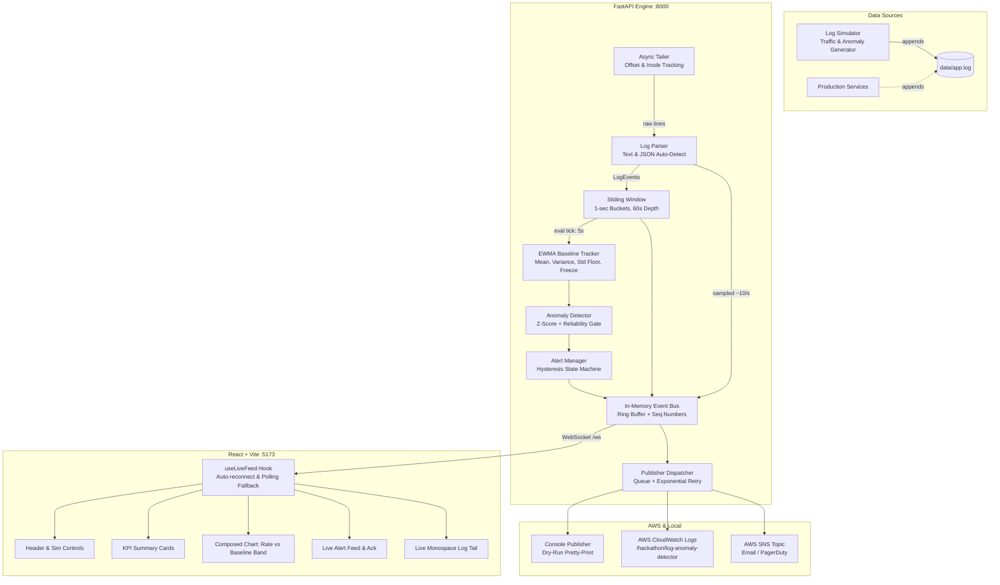

# Accentra — Real-Time Log Anomaly Detector

> A production-grade **Python (FastAPI) + React (TypeScript + Vite)** observability system that tails active log files, computes sliding error rates, learns statistical baselines via EWMA, detects anomalies with multi-threshold Z-scores, visualizes live data via WebSocket streaming with polling fallback, and publishes structured alerts to AWS CloudWatch Logs & SNS.

---

## ⚡ 5-Line Quick Start

```bash
# 1. Clone & Enter
cd Accentra

# 2. Run backend tests (70/70 unit & E2E tests pass)
cd backend && python -m pytest -v && cd ..

# 3. Start Backend in one terminal
cd backend && python -m uvicorn app.main:app --port 8000 --reload

# 4. Start Log Traffic Generator in a second terminal
cd backend && python -m simulator.generate_logs --file ../data/app.log --rps 30 --base-error 0.02

# 5. Start Frontend Dashboard in a third terminal
cd frontend && npm run dev
# Open http://localhost:5173
```

---

## 🏗️ Architecture



---

## ⚙️ Configuration (`.env`)

| Variable | Default | Description |
|---|---|---|
| `LOG_FILE_PATH` | `./data/app.log` | Path to target log file |
| `LOG_FORMAT` | `auto` | Parsing format (`auto`, `text`, or `json`) |
| `WINDOW_SECONDS` | `60` | Length of sliding window in seconds |
| `EVAL_INTERVAL_SEC` | `5` | Frequency of evaluation loop in seconds |
| `MIN_EVENTS_IN_WINDOW` | `20` | Reliability floor to prevent false alarms on sparse traffic |
| `BASELINE_WARMUP_SAMPLES` | `24` | Warmup samples before anomaly detection starts (24 × 5s = 2 min) |
| `BASELINE_ALPHA` | `0.05` | EWMA smoothing factor |
| `BASELINE_MIN_STD` | `0.01` | Std floor to prevent division-by-zero on flat baselines |
| `FREEZE_BASELINE_DURING_ALERT` | `true` | Prevents active spikes from poisoning the baseline |
| `Z_LOW` / `Z_MEDIUM` / `Z_HIGH` / `Z_CRITICAL` | `3.0 / 4.5 / 6.5 / 9.0` | Z-score severity classification boundaries |
| `MIN_ABS_RATE` | `0.05` | Minimum absolute error rate (5%) required to open an alert |
| `CONFIRM_TICKS` | `2` | Consecutive breaching ticks required to open alert (anti-flapping) |
| `RESOLVE_TICKS` | `3` | Consecutive calm ticks required to resolve alert |
| `ALERT_COOLDOWN_SEC` | `120` | Minimum cooldown period after resolution |
| `PUBLISH_MODE` | `dry_run` | `dry_run` (stdout) or `aws` (CloudWatch + SNS) |
| `AWS_REGION` | `ap-south-1` | Target AWS region |

---

## 🎬 3-Minute Live Demo Script

1. **(0:00 - Baseline Learning)**
   - Open http://localhost:5173.
   - Point out the KPI cards: EWMA baseline is learning (`12/24` samples), observed rate is ~2.0%.
   - Show the live log tail streaming formatted events.
2. **(0:30 - Anomaly Injection)**
   - Click the **Simulate ▾** dropdown in the header and choose **Error Spike (35%)**.
   - Watch the red line on the chart surge above the cyan baseline band and breach the 5% gate.
3. **(0:50 - Multi-Channel Alert & Root Cause)**
   - The alert card slides into the Alert Feed with **MEDIUM** or **HIGH** severity.
   - Highlight the root causes: **Top Errors in Window** automatically extracts error templates (e.g. `DB connection timeout ×142`).
   - Show the AWS delivery checkmarks (`CW ✓`, `SNS ✓`).
4. **(1:30 - Recovery & Anti-Poisoning)**
   - Click **Recover** in the header.
   - Traffic normalizes; after 3 calm ticks, the alert shifts to **RESOLVED (duration: ~45s)**.
   - Point out that the baseline did **not** get corrupted by the spike because baseline updates were frozen during the breach!
5. **(2:15 - Network Resilience)**
   - Stop the backend process: the header connection pill changes to amber **RECONNECTING...** and then blue **FALLBACK (POLLING)**.
   - Restart the backend: the client seamlessly recovers to **LIVE (WS)** without reloading the page.

---

## 🧪 Testing

All 70 backend unit and end-to-end integration tests run in under 5 seconds:

```bash
cd backend
python -m pytest -v
```

Tests cover:
- **Log parser:** Standard text, JSON lines, log level normalization, malformed lines, missing fields.
- **Sliding window:** Bucket eviction, rolling rates, events/sec, top errors counter, cleanup.
- **EWMA baseline:** Warmup gating, alpha convergence, freeze on anomaly, standard deviation floor, JSON disk persistence.
- **Detector & severity:** Z-score boundary transitions, minimum rate gate, reliability gate.
- **Alert manager:** Confirm ticks, escalation without duplicate events, calm resolution, cooldown flap protection.
- **Publishers:** Console dry-run, mocked CloudWatch Logs structured JSON, mocked SNS topic dispatch, dispatcher retry with exponential backoff.
- **End-to-End:** Full asynchronous pipeline simulation with synthetic anomalies and event bus validation.

---

## 🐳 Docker Deployment

To launch the complete stack with Docker Compose:

```bash
# Production compose with backend, simulator, and frontend
docker compose up --build -d

# Check running services
docker compose ps
```
